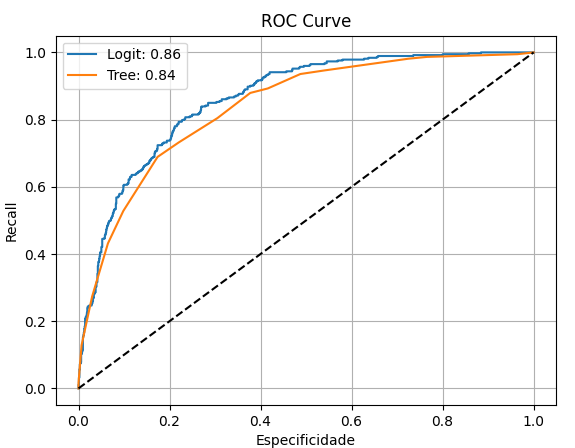
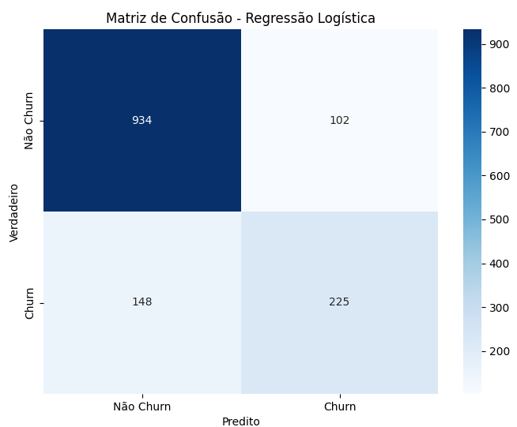

# Churn Prediction

### 📌 Project Description

This project aims to predict customer churn (contract cancellation) using the public Telco Customer Churn dataset from Kaggle.

Two machine learning models were implemented and compared:

Logistic Regression (Logit / GLM)
Decision Tree

The main goal is to evaluate their performance using standard classification metrics and provide recommendations for real-world business scenarios.

### ⚡ Business Objective

Telecom companies face high customer churn rates.
A predictive model can help:

Identify customers at risk of leaving.
Support retention strategies.
Reduce costs related to customer acquisition.

### Project Structure

Data Cleaning & Preprocessing
Converted categorical and numerical features.
Handled missing values in TotalCharges.
Applied one-hot encoding for categorical variables.
Modeling
Logistic Regression (GLM / logit)
Decision Tree (with max_depth=4 to prevent overfitting)
Evaluation
Accuracy
Precision
Recall
AUC (Area Under the ROC Curve)
Confusion Matrix
ROC Curve Visualization

## Results Comparison

Both models achieved good separation ability (AUC 0.84 – 0.86).
Recall was moderate at the default threshold (0.5).
Adjusting the threshold (e.g., 0.3) increases recall, which may be more suitable for churn prediction.

 
 

## 📈 Key Results

| Model | Accuracy | Precision | Recall | AUC |
|:---:|:---:|:---:|:---:|:---:|
| Logistic Regression | 0.82 | 0.69 | 0.60 | 0.86 |
| Decision Tree | 0.81 | 0.65 | 0.52 | 0.84 |

 
 

### Conclusion

Logistic Regression performed better overall, balancing precision and recall, with higher AUC.

Decision Tree is more interpretable but had lower recall at the default threshold.

For churn prediction, adjusting the decision threshold (e.g., 0.3) is recommended to prioritize recall and capture more at-risk customers.

### 🛠️ Tech Stack

Python 
Pandas / NumPy
Matplotlib / Seaborn
scikit-learn

### Dataset

Telco Customer Churn – Kaggle

### Next Steps

Test other algorithms (Random Forest, XGBoost).
Handle class imbalance (SMOTE, undersampling).
Hyperparameter tuning with GridSearchCV.
Optimize threshold based on F1-score or Recall priority.

🔗 Author: Gustavo Martins  – Data Science Portfolio Project

🇧🇷 Português
### 📌 Descrição

Este projeto tem como objetivo prever o churn de clientes (cancelamento de contrato) utilizando o dataset público Telco Customer Churn (Kaggle).

Foram implementados dois modelos de machine learning:

Regressão Logística (Logit / GLM)
Decision Tree (Árvore de Decisão)

O objetivo principal é avaliar a performance de cada modelo utilizando métricas clássicas de classificação e recomendar a melhor abordagem para o problema de negócio.

### ⚡ Objetivo de Negócio

Empresas de telecomunicação sofrem com alta taxa de cancelamento de clientes (churn).
Um bom modelo preditivo permite:

Identificar clientes em risco de cancelamento.
Apoiar estratégias de retenção.
Reduzir custos com aquisição de novos clientes.

### Estrutura do Projeto

Importação e limpeza dos dados
Conversão de variáveis numéricas e categóricas.
Tratamento de valores nulos na coluna TotalCharges.
One-hot encoding para variáveis categóricas.
Modelagem
Regressão Logística (GLM / logit)
Decision Tree (com max_depth=4 para evitar overfitting).
Avaliação
Acurácia
Precisão
Recall
AUC (Área sob a curva ROC)
Matriz de confusão
Curva ROC

## Comparação de Resultados

Ambos os modelos apresentaram boa capacidade de separação (AUC 0.84 – 0.86).
O recall foi moderado no threshold padrão (0.5).
Ajustando o threshold (ex: 0.3), é possível aumentar recall, o que pode ser mais adequado em churn prediction.

 
 

## 📈 Principais Resultados

| Model | Accuracy | Precision | Recall | AUC |
|:---:|:---:|:---:|:---:|:---:|
| Logistic Regression | 0.82 | 0.69 | 0.60 | 0.86 |
| Decision Tree | 0.81 | 0.65 | 0.52 | 0.84 |

 
 

### Conclusão

A Regressão Logística apresentou melhor equilíbrio entre precisão e recall, além de maior AUC.

A Árvore de Decisão é mais interpretável, mas teve recall menor no threshold padrão.

Para previsão de churn, recomenda-se ajustar o threshold de decisão (ex: 0.3) para priorizar recall e identificar mais clientes em risco.

### 🛠️ Tecnologias Utilizadas

Python
Pandas / NumPy
Matplotlib / Seaborn
scikit-learn

### Dataset

Telco Customer Churn – Kaggle

### Próximos Passos

Testar outros algoritmos (Random Forest, XGBoost).
Balanceamento de classes (SMOTE, undersampling).
Ajuste de hiperparâmetros com GridSearchCV.
Otimização do threshold com base em F1-score ou Recall como prioridade.

🔗 Author: Gustavo Martins  – Data Science Portfolio Project
